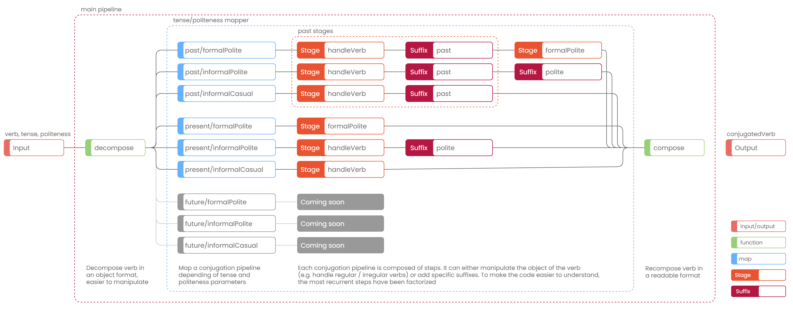

# Pipeline design
Contents
- [Summary](#summary)
    - [Issue](#issue)
    - [Decision](#decision)
    - [Status](#status)
- [Details](#details)
    - [Assumptions](#assumptions)
    - [Positions](#positions)
    - [Argument](#argument)
    - [Solution](#solution)
    - [Implications](#implications)
    - [Related principles](#related-principles)
- [Schema](#schema)

## Summary

### Issue
Korean conjugation system is made in such a way that there are many similar steps during the conjugation process.
On the other hand, it exists a lot of irregular verbs, that makes the process complex.
As a result, we easily get duplicated code, difficult to maintain.
The domain is the most important part of an application, so I have to make sure it is easily understandable and maintainable.

### Decision
Pipeline design introduced in this document is the design I came up with.

### Status
Implemented.

## Details

### Assumptions
The conjugation domain is likely to evolve:
- The design must be easily maintainable
- The design should encourage code reuse and avoid code duplication
- The domain must be easily functionally understandable
- The domain will have to integrate of similar conjugation patterns
- The domain may have to integrate different conjugation patterns (should do, must do)

### Positions
The following solutions were considered:
- Creating a JSON object referencing rules for every conjugation patterns (e.g. for "present/polite", add 습니다 suffix)
- Create a conjugation function for every conjugation patterns
- Factoring code for conjugation pattern with the same "tense" or "politeness" parameter 

### Argument
Above positions:
- Creating a JSON object -> Design limited compared to the number of conjugation patterns
- Creating conjugation functions -> Leads to a lot of code duplication
- Factoring code for conjugation pattern -> Some patterns with the same "tense" might be factored, with "politeness" too. However, both parameters together create kind of a matrix, that multiply the number of possibilities 

### Solution
- Pipeline design results from the combination of creating a conjugation function for every pattern, and having factored and reusable code
- Pipeline design prefer [declarative](https://en.wikipedia.org/wiki/Declarative_programming) to [imperative](https://en.wikipedia.org/wiki/Imperative_programming) programing
- Pipeline design split code in stages with an explicit name and [single responsibility](https://en.wikipedia.org/wiki/Separation_of_concerns)
- It is made of:
  - A main pipeline that contains decomposition and recomposition stages
  - A specific conjugation pipeline for every patterns
  - Reusable stages that factor complex business cases
  - Prefix/suffix functions for simples business cases

### Implications
- Adding a conjugation pattern involve creating a new conjugation pipeline
- Pipeline design incorporates on functional programing paradigm, so new collaborators have to be comfortable with it
- Pipeline design have a lot of common with 

### Related principles
If you don't know (yet) or don't feel at ease with functional paradigm, [MostlyAdequateGuide](https://github.com/MostlyAdequate/mostly-adequate-guide) is a good place to start.

## Schema
